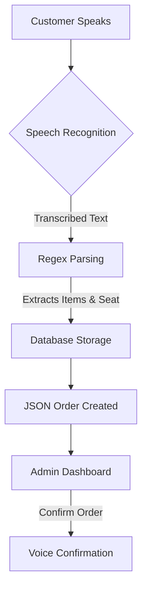

# 🎙️ Voice-Activated Ordering System


### *Revolutionizing the dining experience with the power of your voice.*

---

## 🌟 Overview

Welcome to the **Voice-Activated Ordering System**, a cutting-edge Django application designed to streamline the food ordering process. By integrating advanced **Speech Recognition** and **Text-to-Speech** technologies, this system allows customers to place orders simply by speaking, providing a seamless and hands-free experience.

> [!TIP]
> This project is perfect for modern restaurants, kiosks, or any service-oriented business looking to enhance customer interaction through AI.

---

## ✨ Key Features

| Feature | Description |
| :--- | :--- |
| **🎙️ Voice Recognition** | Uses Google Speech Recognition API to accurately transcribe customer orders. |
| **🔢 Intelligent Extraction** | Automatically identifies food items (Burger, Pizza, etc.) and seat numbers from natural language. |
| **💾 Robust Data Management** | Stores orders in a relational SQLite database and generates JSON backups for real-time tracking. |
| **🔊 Audio Feedback** | Confirms orders with high-quality text-to-speech using `pyttsx3`. |
| **📱 Clean Dashboard** | A minimalist web interface to monitor and confirm active orders. |

---

## 🛠️ Technology Stack

<p align="left">
  
  
  
  
</p>

---

## 🚀 Getting Started

### Prerequisites

- **Python 3.10+**
- **PyAudio** (requires PortAudio headers)
- **Active Internet Connection** (for Google Speech API)

### Installation

1.  **Clone the Repository**
    ```bash
    git clone https://github.com/KarthikShivakumara/Voice-Ordering.git
    cd Voice-Ordering
    ```

2.  **Install Dependencies**
    ```bash
    pip install -r voice_ordering/requirements.txt
    ```

3.  **Run Database Migrations**
    ```bash
    python voice_ordering/manage.py migrate
    ```

4.  **Launch the Server**
    ```bash
    python voice_ordering/manage.py runserver
    ```

---

## 📖 Usage Flow




1.  Navigate to `http://127.0.0.1:8000/recognize/`.
2.  Click the microphone and say: *"I want a **burger** and a **pizza** for **seat number five**"*.
3.  The system will process the audio and display the order on the dashboard.
4.  Admin confirms the order, and the system speaks back the confirmation.

---

## 🔮 Future Enhancements

- [ ] **Multi-language Support**: Expanding beyond English.
- [ ] **Custom Menu Integration**: dynamic menu loading from the database.
- [ ] **Mobile App**: Native Android/iOS interface.
- [ ] **Offline Recognition**: Using Vosk or PocketSphinx for local processing.

---

<p align="center">
  Developed with ❤️ by <b>Karthik Shivakumara</b>
</p>